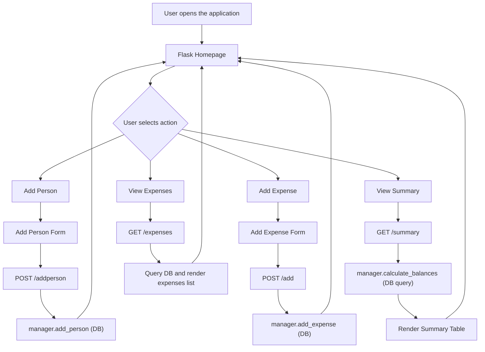

# Splitz

Splitz is a lightweight and intuitive web application built with Python (Flask), designed to eliminate the stress of splitting group expenses during trips. Easily add participants, track your expenses, and get an automatic, transparent summary of who owes what.

Github Repository - https://github.com/sirocorriga-hash/Project-module-two
Web service - https://project-module-4.onrender.com

## Key Features

Central Dashboard: Instant overview of the number of participants and total spending volume.
Dynamic Management: Quickly add new members to your travel group.
Transparent Tracking: Detailed logging of every expense, specifying who paid and who participated.
Automated Balance Calculation: The integrated engine instantly determines the net debt or credit for every participant.
Responsive Design: Clean, "mobile-first" interface based on Bootstrap 5.3.
Data Persistence: Person and expense data is now stored in a relational database (SQLite) via Flask-SQLAlchemy, so nothing is lost when the application restarts.

## Project Report – Python Application "Splitz"

### Introduction

This project was developed as part of a beginner-level Python programming course and consists of a web application called "Splitz", designed to manage and split shared expenses among multiple users. The main objective of the project was to apply in a practical and realistic context the fundamental concepts learned during the course, with particular focus on Python programming basics, object-oriented programming, and web development using the Flask framework.

Since this is my first experience working with Python code, I have consciously chosen to maintain a very elementary approach, avoiding unnecessary complications while striving for absolute precision in how the different functionalities and technologies are interconnected. Specifically, I have focused on the integration of Bootstrap, Flask, and Jinja, bridging them seamlessly with the HTML and CSS frontend components.

The application simulates a real-life scenario in which a group of people share expenses, such as during a trip or a collective activity. It provides an automated system for tracking payments and calculating balances between participants in a transparent and efficient way.

## About this project

"Splitz" is a beginner-level web application developed as part of a Python programming course. The project is inspired by real-world expense-splitting tools and simulates a simplified system for managing shared costs among multiple users.

The main goal of this project was not to create an original product, but to gain practical experience in software development by implementing the core functionalities of a web application using Python and the Flask framework.

Through this project, I focused on learning and applying key concepts such as object-oriented programming, backend logic design, and web development fundamentals. Particular attention was given to the integration between the Flask backend, Jinja2 templating engine, and a Bootstrap-based frontend.

The application allows users to be added, expenses to be recorded, and automatically calculates balances between participants, simulating a basic shared-cost settlement system.

This project represents a first step toward understanding how full-stack web applications are structured, from routing and business logic to user interface rendering.

Persistent database integration, user authentication, and a REST API were originally listed as possible future improvements. In the second phase of the project, persistent data storage was actually implemented (see the "Database Integration" section below); user authentication and a REST API remain possible future improvements.

## Problem Analysis and System Objectives

The problem addressed by the application is the management of shared expenses among multiple users, where each participant may pay for common costs on behalf of the group. Without an automated system, calculating reimbursements and balances would require manual operations that are time-consuming and prone to errors.

The main objective of the system is to fully automate this process by allowing users to register, add expenses, and instantly obtain an updated overview of debts and credits among participants. The system is designed to ensure data consistency, ease of use, and clarity in the representation of financial results.

## General Architecture of the Application

The application is built using Flask, a lightweight Python web framework that enables modular and flexible web development. The architecture follows a simplified Model-View-Controller (MVC)-like approach, where data logic is separated from presentation logic.

Flask routes are responsible for handling HTTP requests and connecting the user interface with the backend logic. The core business logic is centralized in a separate module that manages users and expenses.

The project is therefore structured into three main layers: backend logic implemented in Python, data management through object-oriented programming — now persisted to a relational database (see below) — and presentation using HTML templates with Jinja2 and Bootstrap.

## Object-Oriented Programming and Data Structure

A fundamental part of the project is implemented using object-oriented programming principles. A class was defined to represent a single person (`Person`) and a class to represent a single expense (`Expense`), encapsulating the essential information required by the system: a description of the expense, the amount, the date, and the user who paid for it. The amount is stored as a floating-point number to allow accurate mathematical operations.

In the first version of the project, a second component acted as the main application manager, maintaining the global state of the system through two simple in-memory lists (one of users and one of expenses) — an approach that simulated an "on-the-fly" database, common in educational-level projects.

In the second phase, this in-memory structure was replaced with real persistence on a relational database (see the "Database Integration" section below): the `ExpenseManager` class keeps the same public interface — the same methods, used the same way by the Flask routes — but internally every operation now reads from and writes to the database via Flask-SQLAlchemy, so data is no longer lost when the server restarts.

## Database Integration

In the second development phase of the project, the main goal was to replace in-memory persistence (volatile Python lists, reset on every restart) with a real relational database, to ensure that person and expense data is reliably preserved.

### Technologies Used

- **SQLite**: relational database engine chosen for its simplicity — it requires no dedicated server, and the entire database is contained in a single file (`splitz.db`), which makes it ideal for a learning project and for an initial deployment.
- **Flask-SQLAlchemy**: a Flask extension that integrates SQLAlchemy — the main ORM (Object-Relational Mapper) in the Python ecosystem — into the application. It allows database tables to be defined as Python classes (models), avoiding hand-written SQL for the most common operations.
- **SQLAlchemy ORM**: used to define the two main domain entities, `Person` and `Expense`, as classes inheriting from `db.Model`, and to manage the relationships between them through Python objects instead of manually written JOINs.

### Activities Carried Out

- Created the `db = SQLAlchemy()` instance and configured the connection string (`SQLALCHEMY_DATABASE_URI = "sqlite:///splitz.db"`) in `app.py`.
- Defined the `Person` model, with a numeric identifier (`id`, primary key) and a unique `username`.
- Defined the `Expense` model, with a description, amount, creation date, and a reference to the paying person (`paid_by_id`, foreign key to `Person`).
- Created an association table (`expense_participants`) to model the many-to-many relationship between expenses and participants: an expense can involve several people, and a person can take part in several expenses.
- Added convenience properties on the `Expense` model (`paid_by`, `participants`) to expose usernames instead of raw IDs when HTML templates need to display the data.
- Rewrote the `ExpenseManager` class so that every method (adding, editing, and deleting people and expenses, calculating balances) queries and updates the database instead of manipulating in-memory lists, while keeping the same interface used by the Flask routes in `app.py` — so the rest of the application required no changes.
- Added application-level integrity checks: it is not possible to delete a person who is still linked to one or more expenses (as payer or participant), preventing "orphaned" references in the database.
- Automatic table initialization at application startup via `db.create_all()`, run inside an application context.

### Database Structure

The database consists of three tables: `person`, `expense`, and `expense_participants` (the bridge table). In summary: a person can pay for multiple expenses (one-to-many relationship via `paid_by_id`), and multiple people can take part in the same expense, just as an expense can have multiple participants (many-to-many relationship implemented through `expense_participants`).


## Request Handling and Backend Functionality

The application uses Flask routing to manage different functionalities. Each route corresponds to a specific page or action within the system. HTTP requests are handled by distinguishing between GET and POST methods: GET requests are used to display pages, while POST requests are used to process data submitted through forms.

The process of adding users and expenses follows a standard web flow: data is collected through HTML forms, sent to the server, processed by Python logic — now reading from and writing to the database — and then the user is redirected to an updated page. This mechanism prevents duplicate submissions and ensures a consistent user experience.

## User Interface and Frontend Design

The graphical interface is built using HTML, Bootstrap, and Jinja2. Bootstrap ensures a modern, responsive, and visually consistent layout without requiring complex custom CSS.

Templates are organized using a base layout that is extended by all pages. This modular approach reduces code duplication and improves maintainability.

The application pages are designed to guide the user intuitively. The homepage introduces the system, the expenses page displays all recorded transactions, the add-expense page allows new entries, and the summary page presents final balances clearly, using visual indicators to distinguish credits and debts.

## Tech Stack

Backend: Python 3, Flask
Database: SQLite, Flask-SQLAlchemy (ORM)
Frontend: HTML5, CSS3, Bootstrap 5.3
Template Engine: Jinja2
Architecture: Simplified MVC pattern (Model-Controller-View)

## Flowchart



## Available Environments

The app is accessible at http://127.0.0.1:5000 locally and at https://project-module-4.onrender.com in production.

## Project Structure

app.py: Main controller handling Flask routes and interaction logic.
models.py: Contains the database models (`Person`, `Expense`), the `expense_participants` association table, and the `ExpenseManager` class with the balance calculation logic.
splitz.db: SQLite database file, automatically generated at application startup via `db.create_all()`; holds the persistent person and expense data.
/templates/: HTML files that compose the application views.
/static/: CSS files (style.css) and static assets.

## Contributing

This project is open to contributions. If you have ideas to improve the balance algorithm or want to implement additional functionality (such as user authentication or a REST API), feel free to open an Issue or submit a Pull Request.

## Quick Start Guide

Clone the repository:

```bash
git clone https://github.com/sirocorriga-hash/Project-module-two.git
cd Project-module-two
```

Set up a virtual environment:

```bash
python -m venv venv
source venv/bin/activate  # Mac/Linux
venv\Scripts\activate     # Windows
```

Install dependencies:

```bash
pip install flask flask-sqlalchemy
```

Run the application:

```bash
python app.py
```

